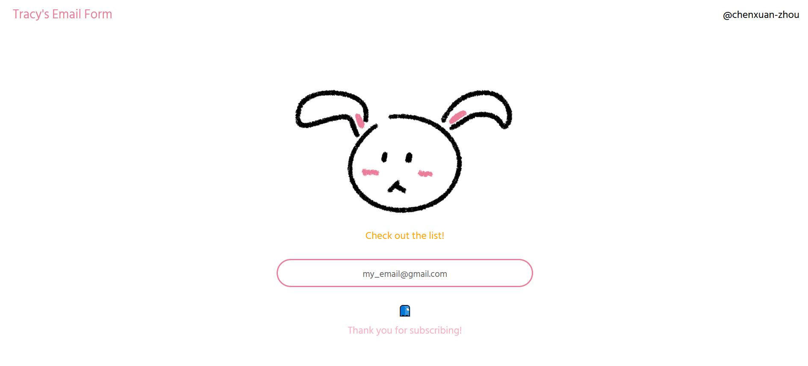
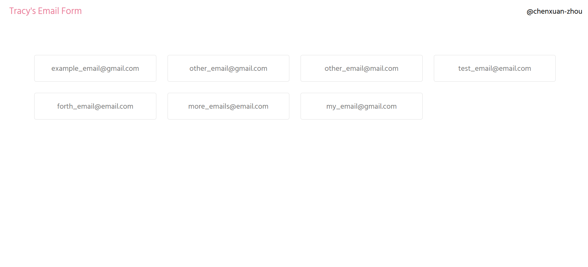

# Email Submit Form

A frontend of a simple email submit form, similar to [hackmcgill.com](https://hackmcgill.com).
The body and email box style in the index page are taken from [the hackmcgill style](https://github.com/hackmcgill/hackmcgill/blob/develop/src/style/main.scss).

## Pages

The index page contains the subscription form. It has a link to the subscription list page.

The `/list` page contains a list of emails subscribed to the list. It is simply a demonstration that the emails are indeed persisted.

